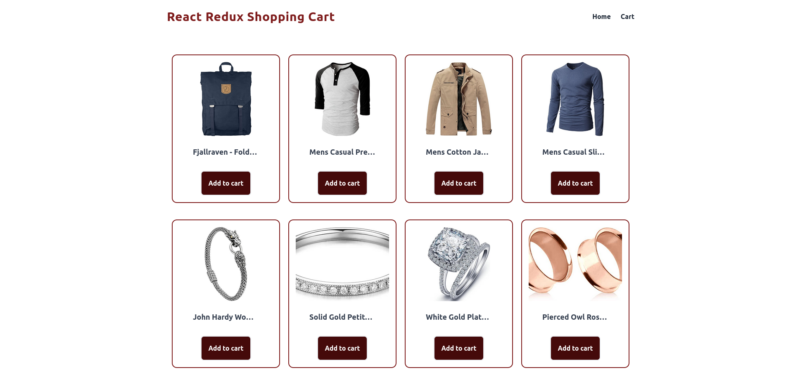
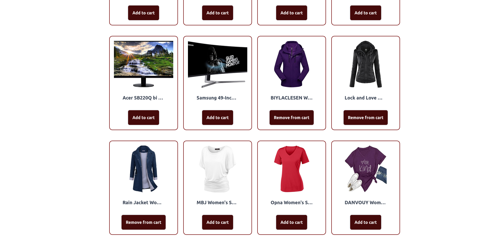
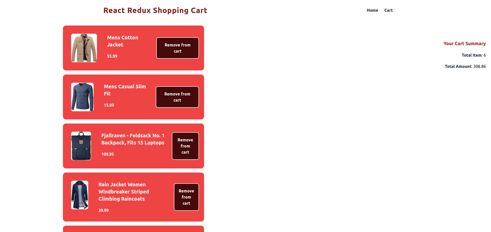
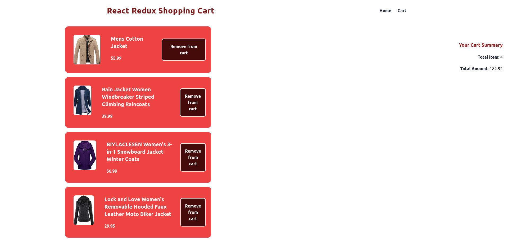
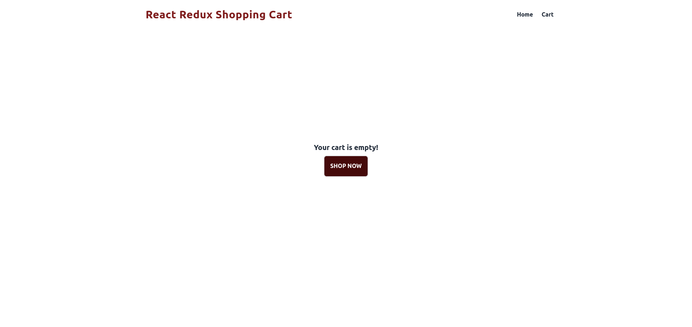

### Shopping Cart

👉 This is 23th project Of FreeCodeCamp course Build 25 React Projects 😎

https://fakestoreapi.com
Fake Store API
Fake store API provides pseudo-real data for your e-commerce or shopping website prototype without running any server-side code. You can use it for teaching, sample codes, tests, etc. and access 4 main resources: products, carts, users and login.

✏️ Created by @sangammukherjee on Youtube Channel

#### covers images of project

👇 Home page

👇 Home page with products added to cart

👇 Cart page

👇 Cart page with product removed from cart

👇 Empty Cart Page

🙏 great, this is an awesome course project and this is very simple and to much explained!

✍ Ps. "I'll think like a man in the better way to find my self"
